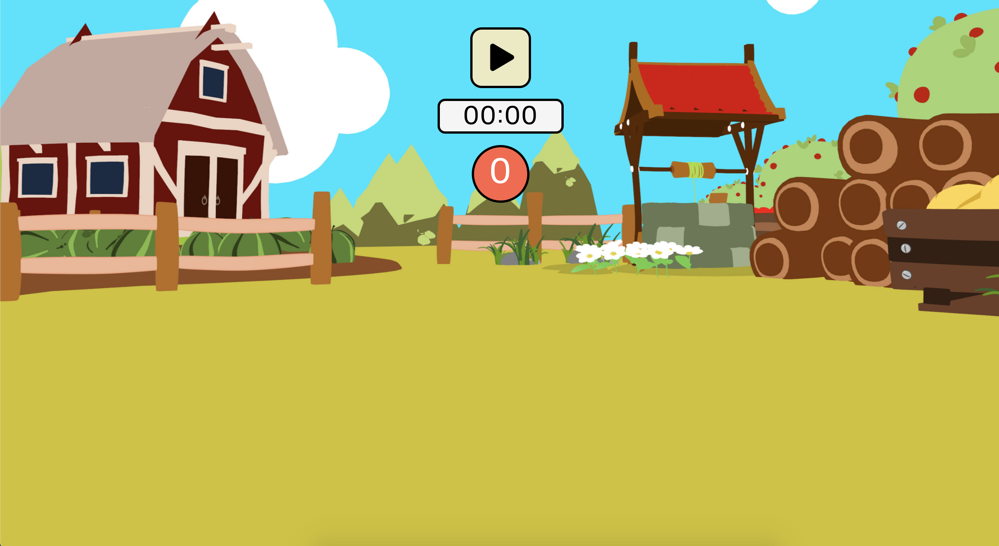
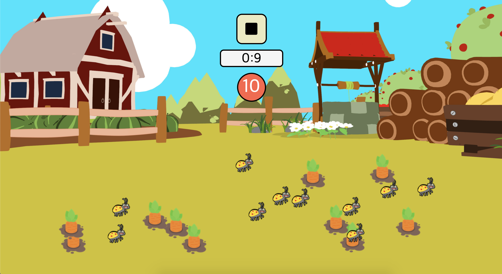
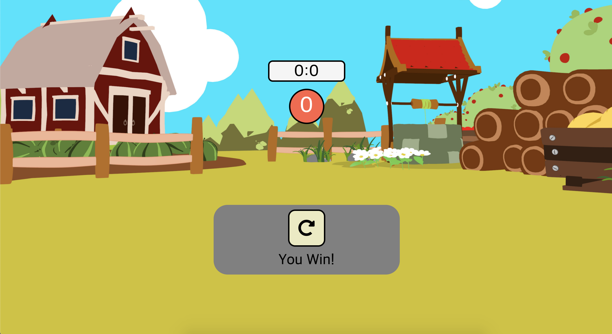

# Mini-Game
with vanila JS

## 당근 찾기 게임

### 1. 게임 시작

화면 상단 Play Button을 누르면 당근과 벌레가 필드에 랜덤하게 배치되고 타이머와 남은 당근 개수가 세팅됩니다. 

### 2. Restart

게임 진행중 상단 멈춤 버튼을 누르면 리플레이 버튼이 나오는데, 이 버튼을 누르면 게임이 다시 시작됩니다.

### 3. 게임 끝!

10초 안에 당근을 모두 클릭하면 승리하고, 벌레를 클릭하거나 시간 안에 당근을 모두 클릭하지 못 하면 패배합니다. 

